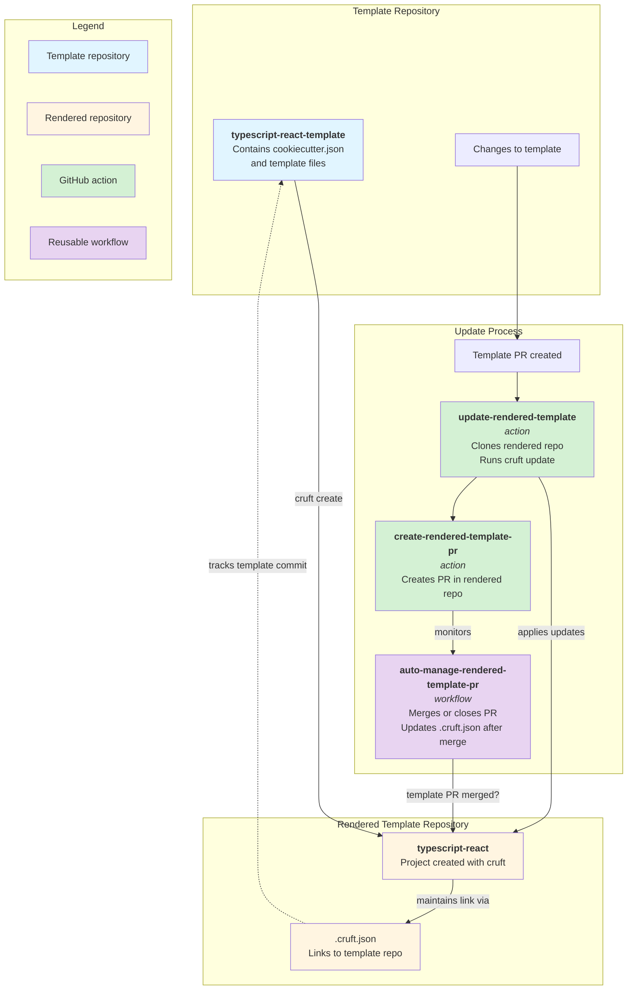

# Template actions

This repository contains actions and reusable workflows for building EIDP templates.

## Template and rendered template flow

The actions in this repository facilitate the process of keeping rendered templates up to date with changes made to their source templates so we have immediate feedback whether the template changes work as expected.
The diagram below illustrates the flow between the template repository, the rendered template repository, and the update process using the provided actions and workflows.



### How it works

1. **Template repository** (e.g., `typescript-react-template`) contains the cookiecutter template with `{{cookiecutter.*}}` variables
2. **Rendered repository** (e.g., `typescript-react`) is created using `cruft create` and maintains a `.cruft.json` file linking back to the template
3. When changes are made to the template, the `update-rendered-template` action uses cruft to apply those changes to the rendered repository
4. The `create-rendered-template-pr` action creates a PR in the rendered repository with the updates
5. The `auto-manage-rendered-template-pr` workflow automatically merges or closes the PR based on the template PR status. It also updates the `.cruft.json` file to point to the latest commit in the template repository after merging

<!-- BEGIN ACTIONS -->

## 🛠️ GitHub Actions

The following GitHub Actions are available in this repository:

- [create-rendered-template-pr](create-rendered-template-pr/README.md)
- [monitor-rendered-template-workflow-status](monitor-rendered-template-workflow-status/README.md)
- [test-template](test-template/README.md)
- [update-rendered-template](update-rendered-template/README.md)

<!-- END ACTIONS -->

<!-- BEGIN SHARED WORKFLOWS -->

## 📚 Shared Workflows

The following reusable workflows are available in this repository:

- [auto-manage-rendered-template-pr](./.github/workflows/README.md#auto-manage-rendered-template-pr-workflow)

<!-- END SHARED WORKFLOWS -->

## Development

### Pre-commit hooks

To ensure code quality and consistency, this repository uses
[pre-commit](https://pre-commit.com/) hooks. Make sure to install the pre-commit
hooks by running:

```bash
pre-commit install
```
